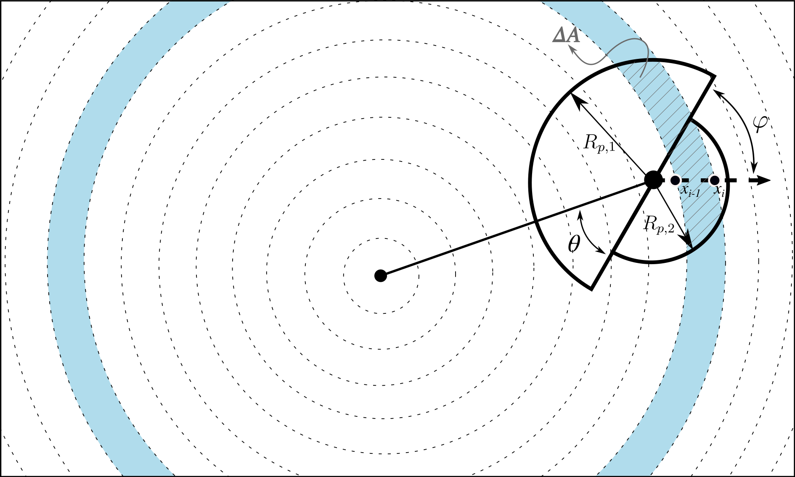

# Summary

An exoplanet is a planet outside of the Solar System, orbiting a star other than our Sun. Their observation and characterisation is a rapidly-evolving field of study in Astrophysics. There are several established exoplanet detection methods, however the most successful method to date is transit photometry, which has discovered over 4000 exoplanets. This method works by measuring periodic dips in light from a star caused by an orbiting planet eclipsing it.  
Previous packages, such as ``batman`` [@Kreidberg:2015], can model these lightcurves, assuming that the exoplanet is spherically symmetric.

Normally, the depth of a transit as observed by detectors is directly proportional to the radius of the exoplanet if it has no atmosphere.     
If the planet does have an atmosphere then due to the specific molecules present and their abundance, an atmopshere will absorb different wavelengths of light passing through it at differing strengths. Therefore the depth of the transit is dependent on both the size of the exoplanet and the height, density and composition of its atmosphere. This technique, transit spectroscopy, is a very powerful tool to constrain the atmospheric elemental abundances in gas giant exoplanets.

For large gas giants orbiting very close-in to their host stars (highly irradiated hot Jupiters), large temperature differences between their day and night sides have been observed. It has been predicted (not sure if detected??) that they may rotate in such a way that they produce winds on the surface of the planet that could transport clouds formed on the colder nightside across to the dayside (the side facing the star). 
If this happens, then on one boundary (or 'terminator') between the nightside and dayside, the atmosphere would have a very different composition to the terminator on the opposite side. Therefore at specific wavelengths, one side of the planet may absorb more or less light than the other side, causing an asymmetry between the two terminators. ``catwoman`` can model transits with this assymmetry.

``catwoman`` is a Python package that allows the calculation of light curves for any radially symmetric stellar limb darkening law for planets modelled as two stacked semi-circles, with different radii, using the integration algorithm developed for ``batman``. It is fast and efficient and open source with full documentation available to view.
     
The lightcurves are modelled as follows. The decrease in flux, delta, as a planet transits its star can be approximated by the sum 

$$\delta = \sum_{i=1}^{N} I\left(x_m\right)\Delta A(x_m,R_{p,1},R_{p,2},\varphi,d)$$,

splitting the semi-circles up into iso-intensity bands centred on the star and for each intersectional segment (like the one shaded in Figure 1) you multiply its area, $\Delta A$, by the intensity of the star and then sum these strips to generate the full delta for a specific distance between the centre of the star and planet, d. The code then increments d by a small pre-determined amount (based on the time array given by the user) and recalculates delta.

The width of the iso-intensity bands determines the truncation error of the model. The model is first initialised with parameters including a maximum truncation error either set by the user or taken as the pre-set value as 1ppm. As in ``batman``, ``catwoman`` first calculates many models, with varying widths and geometrically searches for a width that produces an error less than 1% away (and always less than) the specified level. The model then uses this width value to calculate the desired lightcurves. A lower specified error, and therefore thinner iso-intensity bands, produces more accurate lightcurves, however more steps are needed to calculate delta which takes more time.  

``catwoman`` also allows for phi, the angle of rotation of the semi-circles, to vary as a free parameter, which is something no other model has tried to implement, accounting for the possibility of spin-orbit misalignments of the planet. The two semi-circle radii, $R_{p,1}$ and $R_{p,2}, and other orbital variables are also completely free parameters.

``catwoman`` was designed to be used by astronomical researchers. It is used in Espinoza & Jones (in prep.). 

# Mathematics

Single dollars ($) are required for inline mathematics e.g. $f(x) = e^{\pi/x}$

Double dollars make self-standing equations:

$$\Theta(x) = \left\{\begin{array}{l}
0\textrm{ if } x < 0\cr
1\textrm{ else}
\end{array}\right.$$

# Citations

Citations to entries in paper.bib should be in
[rMarkdown](http://rmarkdown.rstudio.com/authoring_bibliographies_and_citations.html)
format.

For a quick reference, the following citation commands can be used:
- `@author:2001`  ->  "Author et al. (2001)"
- `[@author:2001]` -> "(Author et al., 2001)"
- `[@author1:2001; @author2:2001]` -> "(Author1 et al., 2001; Author2 et al., 2002)"

# Figures

Figures can be included like this: 

# Acknowledgements

# References
