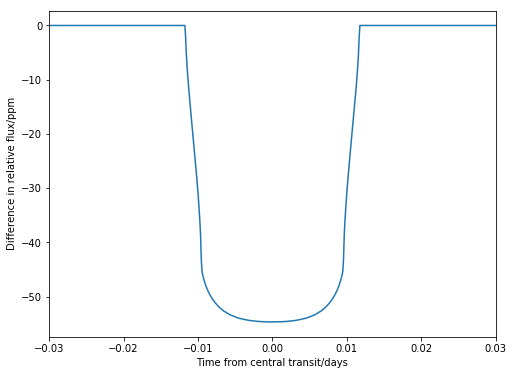

.. _quickstart:

Quickstart
============
This explains how to quickly and easily plot a catwoman transit using the quadratic limb darkening law. For a more detailed explanation of the parameters, inputs and possible outputs, see the :ref:`tutorial` tab.

``catwoman`` is a Python package that models asymmetric transit lightcurves where planets are modelled as two semi-circles. The key parameters involved in the asymmetry include ``params.rp`` and ``params.rp2`` which define the radius of each semi-circle and ``params.phi`` which is the angle of rotation of the top semi-circle defined from -90° to 90° like so: 

.. image:: phidiagram.png 

The first step is to import ``catwoman`` and the packages needed for it to run and to plot the results:

::
	
	import catwoman
	import numpy as np
	import matplotlib.pyplot as plt

Next, following a similar procedure as to that in ``batman``, initialise a ``TransitParams`` object to store the input parameters of the transit:

:: 

	params  = catwoman.TransitParams()
	params.t0 = 0. 				#time of inferior conjuction (in days)
	params.per = 1.				#orbital period (in days)
	params.rp = 0.1 			#top semi-circle radius (in units of stellar radii)
	params.rp2 = 0.1			#bottom semi-circle radius (in units of stellar radii)
	params.a = 15.				#semi-major axis (in units of stellar radii)
	params.inc = 90.			#orbital inclination (in degrees)
	params.ecc = 0. 			#eccentricity
	params.w = 90.				#longitude of periastron (in degrees)
	params.u = [0.1, 0.3]			#limb darkening coefficients [u1, u2]
	params.limb_dark = "quadratic" 		#limbs darkening model
	params.phi = 0.				#angle of rotation of top semi-circle (in degrees) 

Next make the time array to specify the times we want to calculate the model for:

::

	t = np.linspace(-0.05, 0.05, 1000)

Then, to initialise the model and calculate a light curve:

::
	
	model = catwoman.TransitModel(params,t) 	#initalises model
	flux = model.light_curve(params) 		#calculates light curve

To view the light curve: 

::
	
	plt.plot(t, flux)
	plt.xlabel("Time from central transit/days")
	plt.ylabel("Relative flux")
	plt.show()

.. image:: Simplesymmetric.png

To model an asymmetric planet, simply change ``params.rp`` and/or ``params.rp2`` and ``params.phi`` to change the orientation of the system.

Let's try this by re-initialising the parameters we want to change so that one of the semi-circles is 0.5% larger than the other and they are orientated with φ = 90°. There is no need to initialise the full model again here, whenever the light_curve function is run, it updates the parameters:

::

	params.rp = 0.1
	params.rp2 = 0.1005
	params.phi = 90.

Now we calculate the flux again for this new system:

:: 	

	flux2 = model.light_curve(params)

To view this new light curve:

:: 	

	plt.plot(t, flux2)
	plt.xlabel("Time from central transit/days")
	plt.ylabel("Relative flux")
	plt.show()

.. image:: Asymmetric.png

To clearly see the difference between this and the symmetric planet, we can plot the residuals as so:

:: 
	
	res = (flux2 - flux)*10**6
	plt.plot(t, res)
	plt.xlabel("Time from central transit/days")
	plt.ylabel("Difference in relative flux/ppm")
	plt.show()

