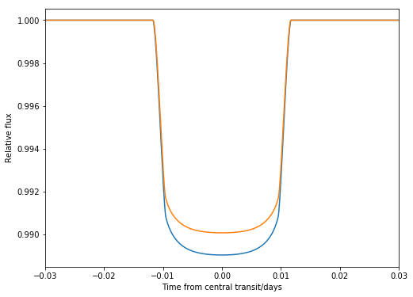
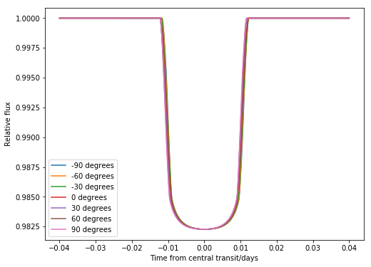

.. _tutorial:
  
Tutorial
============

This tutorial explains in detail the different features of ``catwoman``.

Initialising the model
----------------------

As shown in the :ref:`quickstart`, to start setting up the model, one has to initialise a variety of parameters:
::

	import catwoman
	import numpy as np
	import matplotlib.pyplot as plt
	
	params = catwoman.TransitParams() 	#object to store transit parameters
	params.t0 = 0.				#time of inferior conjuction (in days)
	params.per = 1.				#orbital period (in days)
	params.rp = 0.1				#top semi-circle radius (in units of stellar radii)
	params.rp2 = 0.1005			#bottom semi-circle radius (in units of stellar radii)
	params.a = 15.				#semi-major axis (in units of stellar radii)
	params.inc = 90.			#orbital inclination (in degrees)
	params.ecc = 0.				#eccentricity
	params.w = 90.				#longitude of periastron (in degrees)
	params.u = [0.1, 0.3]                   #limb darkening coefficients [u1, u2]
	params.limb_dark = "quadratic"		#limb darkening model
	params.phi = 0.				#angle of rotation of top semi-circle

	time = np.linspace(-0.04, 0.04, 1000)	#array of times to calculate the light curves for
	model = catwoman.TransitModel(params, time, max_err = 0.1)	#initialises the model

As in ``batman``, the initialisation step automatically calculates the array of separation of centres between the star and the planet and also pre-runs the light_curve function numerous times in order to find the approriate integration step size for a given ``max_err``. 

``catwoman`` does this for all the supported limb darkening laws ("quadratic", "logarithmic", "exponential", "nonlinear", "linear", "power2", "uniform" and "custom").

*Note*: The default for ``max_err`` is 1ppm and describes the allowed error (in ppm) between the smallest integration step size and the selected integration step size. The lower the specified ``max_err``, the smaller the step size and the longer this initialisation step will take to run.

Calculating light curves
-----------------------------  

To calculate a light curve we run the ``light_curve`` function like so:
::
	
	flux = model.light_curve(params) 		#calculates light curve

This flux can now be plotted:
:: 
	
	plt.plot(time, flux)
	plt.xlabel("Time from central transit/days")
	plt.ylabel("Relative flux")
	plt.show()

.. image:: tutorialbasic.png
				  
Alternatively, if you wanted to change a parameter, you can do this by simply redefining the parameter of interest, say it is the ``params.rp``:
::

	params.rp = 0.09 			#top semi-circle radius (in units of stellar radii)

Now the new flux can be quickly calculated without having to re-initialise the model:
::

	flux2 = model.light_curve(params) 	#calculates light curve

To plot the two fluxes:
::

	plt.plot(time, flux)
	plt.plot(time, flux2)
        plt.xlabel("Time from central transit/days")
        plt.ylabel("Relative flux")
        plt.show()

This can be repeated for any ``params`` change. However if you want to change the ``time`` or ``max_err``, the model will need to be reinitialised as a new integration step size will need to be calculated.

This can make it easy to loop over certain parameter inputs and plot many light curves quickly. For example, we can make the light curves for a range of ``phi`` values like so:
::

	flux = np.zeros((7,len(time)))
	params.rp = 0.1
	params.rp2 = 0.15
	
	for i in range(0,7):
		params.phi = (i-3)*30			#updates angle of rotation
		flux[i] = model.light_curve(params)	#calculates light curve
		plt.plot(time,flux[i],label=str((i-3)*30)+'°')
	plt.xlabel("Time from central transit/days")
	plt.ylabel("Relative flux")
	plt.xlim(-0.015, 0.015)
	plt.legend()
	plt.show()

The residuals can also be easily plotted:
::

	for i in range(1,7):
        	plt.plot(time,flux[i]-flux[0],label='flux('+(str((i-3)*30)+'°) - flux(-90°)'))
		plt.xlabel("Time from central transit/days")
	plt.ylabel("Relative flux")
	plt.legend()
	plt.show()

Limb darkening functions
------------------------- 

As for ``batman``, ``catwoman`` allows you to choose one of the following limb darkening functions for the star:

.. math::

	\begin{align}
	  I(\mu) &= I_0                            						& &\text{(uniform)} 		\\
	  I(\mu) &= I_0[1 - c_1(1-\mu)]								& &\text{(linear)}		\\
	  I(\mu) &= I_0[1 - c_1(1 - \mu) - c_2(1-\mu)^2]	 				& &\text{(quadratic)}		\\
  	  I(\mu) &= I_0[1 - c_1(1 - \mu) - c_2(1-\sqrt{\mu})]                                   & &\text{(square-root)}         \\
  	  I(\mu) &= I_0[1 - c_1(1 - \mu) - c_2\mu\ln{\mu}]                                      & &\text{(logarithmic)}         \\
  	  I(\mu) &= I_0\left[1 - c_1(1 - \mu) - c_2/(1-\exp{\mu})\right]                  	& &\text{(exponential)}         \\
  	  I(\mu) &= I_0\left[1 - c_1(1 - \mu^{c_2})\right]                  	& &\text{(power2)}         \\
	  I(\mu) &= I_0[1 - c_1(1-\mu^{1/2}) - c_2(1- \mu) - c_3(1-\mu^{3/2}) - c_4(1-\mu^2)]  	& &\text{(nonlinear)}				
	\end{align}

where :math:`\mu = \sqrt{1-x^2}` where x is the normalised stellar radial coordinate defined between :math:`0 \leq x \leq 1` and :math:`I_O` is the normalisation constant for these laws so that integrated over the whole star, the total intensity is unity.
For each limb-darkening law you will need to provide the correct number of coefficients in order for the package to run.

Error tolerance
----------------
As mentioned in *Initialising the model*, the model contains a parameter called ``max_err``. If this is not specified, it will be set to the default ``max_err = 1.0``.

Whenever the model calculates a light curve from the parameters given it essentially splits up the planet into a series of very small strips of area in order to calculate the intensity of light that is blocked by the planet moving in front of the star at a particular time (see figure below). 

The width of these strips determines the accuracy of the light curve model and this is set by a scaling factor (``fac``). 

Once the model is initialised, internally, the program will calculate the light curve using an extremely small ``fac = 5e-4`` and an extremely large ``fac = 1`` and then find the error (or the largest difference) between their values.
If this is not equal to the ``max_err`` then the ``fac`` that produces an error within 1% of the ``max_err`` is found using a geometric search between the smallest and largest ``fac`` values.

As multiple light curves are being calculated during this step, this is the most time-intensive part of the package. However once the model has been initialised (and the appropriate ``fac`` value has been determined), as previously explained, this doesn't need to be repeated if some of the parameters are changed.

.. image:: strips.png     

Supersampling
---------------
As in ``batman``, for long exposure times there is the option of calculating the average value of the light curve model over the time of exposure of the samples. Set up the model including the additional parameters ``supersample_factor`` and `exp_time` (in days) like so:
::
	model = catwoman.TransitModel(params, time, supersample_factor = 5, exp_time = 0.001)

This will produce a model calculated by splitting up the samples into 5 sub-samples over the duration of the 0.001 day exposure. When a light curve is calculated, it will keep these sub-samples separate until the end where it will calculate the mean of these and reshape the light curve back to the original intended size, as specified by the ``time`` array.   

Parallelisation
----------------
As ``catwoman`` is built upon ``batman``, the library also inherits its support for OpenMP and OpenACC for CPU parallelisation and GPU acceleration, respectively. The former is active by default, but the latter is usually not. We refer users to the ``batman`` documentation to understand how to enable OpenACC on, e.g., NVIDIA GPUs.

 

